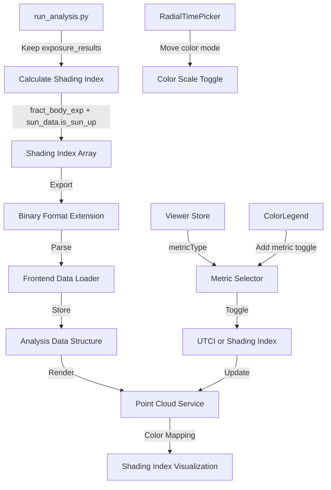

# Shading Index Implementation Plan

## Overview

Add Shading Index metric to complement UTCI analysis. Shading Index measures the proportion of sunlight hours during which each point is fully shaded (no direct solar radiation). This is a point-based calculation (sidewalk area aggregation deferred to future phase).

## Architecture



## Implementation Phases

### Phase 1: Backend - Shading Index Calculation

#### 1.1 Create Shading Index Calculator Module

**File**: `src/fast_utci/mrt/shading_index.py` (NEW)

- Function: `calculate_shading_index(exposure_results: List[ExposureResult], sun_data: SunData) -> np.ndarray`
- Logic:
  - For each position, extract `fract_body_exp` array
  - Filter to sunlight hours: `sun_data.is_sun_up == True`
  - Count hours where `fract_body_exp == 0.0` (fully shaded)
  - Calculate: `shading_index = shaded_hours / total_sunlight_hours`
  - Return array of shape `(n_positions,)` with values 0.0-1.0
- Handle edge cases:
  - No sunlight hours → return 1.0 (fully shaded by definition)
  - All hours exposed → return 0.0
  - NaN/invalid values → return NaN

**Test**: `tests/mrt/test_shading_index.py` (NEW)

- Test with mock exposure data
- Test edge cases (no sun, all sun, partial shading)
- Test calculation accuracy

#### 1.2 Modify run_analysis.py

**File**: `run_analysis.py`

- **Line 273**: Remove `del exposure_results` - keep exposure data
- **After line 302** (after UTCI calculation): Calculate Shading Index
  ```python
  from fast_utci.mrt.shading_index import calculate_shading_index
  
  sun_data = mrt_calc.get_sun_data(analysis_period, target_hours)
  shading_indices = calculate_shading_index(exposure_results, sun_data)
  ```

- Pass `shading_indices` to export function

**Test**: Verify exposure_results are preserved and Shading Index is calculated

#### 1.3 Extend Binary Export Format

**File**: `scripts/export_for_viewer.py`

**Current format** (full day):

```
[8 bytes: num_positions (uint32), num_hours (uint32)]
[num_positions × 12 bytes: positions as float32 x,y,z]
[num_positions × 4 bytes: utci values hour 0 as float32]
...
[num_positions × 4 bytes: utci values hour 23 as float32]
```

**New format** (with optional Shading Index):

```
[8 bytes: num_positions (uint32), num_hours (uint32)]
[num_positions × 12 bytes: positions as float32 x,y,z]
[4 bytes: has_shading_index (uint32, 0 or 1)]
[IF has_shading_index == 1: num_positions × 4 bytes: shading_index as float32]
[num_positions × 4 bytes: utci values hour 0 as float32]
...
[num_positions × 4 bytes: utci values hour 23 as float32]
```

**Changes**:

- Modify `export_binary_full_day()` to accept optional `shading_indices: Optional[np.ndarray]`
- Add `has_shading_index` flag (0 or 1) after positions
- Write Shading Index array if provided
- Update `export_metadata_json()` to include `has_shading_index: bool` field

**Test**:

- Export with Shading Index → verify binary format
- Export without Shading Index → verify backward compatibility
- Parse old format → verify it works

#### 1.4 Update Metadata JSON

**File**: `scripts/export_for_viewer.py` → `export_metadata_json()`

Add to metadata:

```json
{
  "has_shading_index": true,
  "shading_index_range": {
    "min": 0.0,
    "max": 1.0
  }
}
```

**Test**: Verify metadata includes Shading Index info when present

### Phase 2: Frontend - Data Loading & Types

#### 2.1 Extend Type Definitions

**File**: `viewer/src/lib/types/analysis.ts`

- Add to `SingleHourData`:
  ```typescript
  shadingIndex?: Float32Array; // Optional Shading Index values
  ```

- Add to `FullDayData`:
  ```typescript
  shadingIndex?: Float32Array; // Optional Shading Index values
  ```

- Add to `AnalysisMetadata`:
  ```typescript
  has_shading_index?: boolean;
  shading_index_range?: {
    min: number;
    max: number;
  };
  ```


**Test**: TypeScript compilation passes

#### 2.2 Update Binary Parser

**File**: `viewer/src/lib/services/dataLoader.ts`

- Modify `parseFullDayBinary()`:
  - Read `has_shading_index` flag (uint32) after positions
  - If `has_shading_index == 1`, read Shading Index array (num_positions × float32)
  - Store in returned data structure
- Modify `parseSingleHourBinary()`:
  - Same logic (for future single-hour support)
- Add helper: `getShadingIndex(data: UTCIData): Float32Array | null`
  - Returns Shading Index array if available, null otherwise

**Test**:

- Parse binary with Shading Index → verify data loaded correctly
- Parse binary without Shading Index → verify returns null gracefully
- Parse old format → verify backward compatibility

### Phase 3: Frontend - State Management

#### 3.1 Extend Viewer Store

**File**: `viewer/src/lib/stores/viewerStore.ts`

- Add to `ViewerState` type (in `viewer/src/lib/types/viewer.ts`):
  ```typescript
  metricType: 'utci' | 'shading_index';
  ```

- Update initial state:
  ```typescript
  metricType: 'utci',
  ```

- Add function: `setMetricType(type: 'utci' | 'shading_index')`

**File**: `viewer/src/lib/types/viewer.ts`

- Add `MetricType = 'utci' | 'shading_index'` type
- Update `ViewerState` interface

**Test**: Store updates correctly, reactive statements work

### Phase 4: Frontend - Color Scale & Visualization

#### 4.1 Create Shading Index Color Scale

**File**: `viewer/src/lib/services/colorScale.ts`

- Add function: `mapShadingIndexToColor(value: number): RGB`
  - Input: 0.0-1.0 Shading Index value
  - Output: RGB color based on categories:
    - 0.0-0.5: Red (poor shading)
    - 0.5-0.7: Yellow/Orange (acceptable)
    - 0.7-0.9: Light Green (very good)
    - 0.9-1.0: Dark Green (excellent)
  - Use smooth gradient transitions between categories
- Add constant: `SHADING_INDEX_COLORS` array for gradient

**Test**: Color mapping returns correct colors for boundary values

#### 4.2 Update Point Cloud Service

**File**: `viewer/src/lib/services/pointCloudService.ts`

- Modify `createColors()` to accept `metricType: 'utci' | 'shading_index'`
- Add logic:
  ```typescript
  if (metricType === 'shading_index') {
    const shadingIndex = getShadingIndex(data);
    if (!shadingIndex) return fallbackColors; // UTCI colors as fallback
    return mapShadingIndexToColors(shadingIndex);
  }
  // Existing UTCI logic...
  ```

- Update `createPointCloudGeometry()` to accept `metricType`
- Update `updateUtciSurfaceTexture()` to handle Shading Index
- Add helper: `mapShadingIndexToColors(values: Float32Array): Float32Array`

**Test**:

- Point cloud renders with Shading Index colors
- Falls back to UTCI if Shading Index unavailable
- Updates correctly when toggling metrics

#### 4.3 Update UTCI Point Cloud Component

**File**: `viewer/src/lib/components/scene/UTCIPointCloud.svelte`

- Read `metricType` from `$viewerStore`
- Pass `metricType` to `createUtciSurfaceMesh()` and `updateUtciSurfaceTexture()`
- Update reactive statements to respond to `metricType` changes

**Test**: Component updates when metric type changes

### Phase 5: Frontend - UI Components

#### 5.1 Move Color Scale Mode to RadialTimePicker

**File**: `viewer/src/lib/components/ui/RadialTimePicker.svelte`

- Add color mode toggle section below the dial
- Import `setColorMode` from viewerStore
- Add buttons for 'normalized' and 'discrete' modes
- Style to match existing design
- Show only when `analysis_type === 'full_day'` AND `metricType === 'utci'`
- Hide when `metricType === 'shading_index'` (Shading Index is always full-day)

**Test**:

- Color mode toggle appears in RadialTimePicker
- Works correctly for UTCI
- Hidden for Shading Index

#### 5.2 Add Metric Type Toggle to ColorLegend

**File**: `viewer/src/lib/components/ui/ColorLegend.svelte`

- Add metric type selector above gradient:
  - Two buttons: "UTCI" and "Shading Index"
  - Only show "Shading Index" if `metadata.has_shading_index === true`
  - Import `setMetricType` from viewerStore
- Update title to show current metric: `$viewerStore.metricType === 'utci' ? 'UTCI' : 'Shading Index'`
- Update gradient colors based on metric type:
  - UTCI: Use existing Ladybug colors
  - Shading Index: Use Shading Index color scale
- Update labels:
  - UTCI: Show temperature range (existing)
  - Shading Index: Show 0.0, 0.5, 0.7, 0.9, 1.0 with category labels
- Hide color scale mode toggle (moved to RadialTimePicker)

**Test**:

- Metric toggle appears and works
- Gradient updates correctly
- Labels update for each metric
- Shading Index button hidden when data unavailable

#### 5.3 Update RadialTimePicker Visibility

**File**: `viewer/src/routes/+page.svelte`

- Modify RadialTimePicker section (around line 145-151):
  - Add condition: Only show when `$viewerStore.metricType === 'utci'`
  - When Shading Index is active, hide the time picker section entirely
  - Add helpful message: "Shading Index represents full-day shading coverage"

**Test**:

- Time picker hidden for Shading Index
- Time picker visible for UTCI
- No layout issues

#### 5.4 Update Analytics Panel

**File**: `viewer/src/lib/components/ui/AnalyticsPanel.svelte`

- Add Shading Index statistics when metric type is 'shading_index':
  - Min, Max, Mean
  - Category distribution (counts for each category)
- Update to show appropriate stats based on `$viewerStore.metricType`

**Test**: Analytics show correct stats for each metric

### Phase 6: Testing & Validation

#### 6.1 Backend Tests

- Test Shading Index calculation with various exposure patterns
- Test binary export/import with and without Shading Index
- Test backward compatibility (old analyses still work)

#### 6.2 Frontend Tests

- Test data loading with/without Shading Index
- Test metric switching
- Test color rendering
- Test UI state management
- Test backward compatibility

#### 6.3 Integration Tests

- End-to-end: Calculate → Export → Load → Visualize
- Verify no breaking changes to existing UTCI workflow

### Phase 7: Documentation & TODOs

#### 7.1 Add Future TODOs

**File**: `src/fast_utci/mrt/shading_index.py`

Add comments/TODOs for future sidewalk area aggregation:

```python
# TODO: Future enhancement - Sidewalk area aggregation
# When sidewalk layers are available:
# 1. Group points by sidewalk segment
# 2. For each hour, calculate % of sidewalk area that is shaded
# 3. Count hours where >50% of sidewalk area is shaded
# 4. Calculate area-based Shading Index
# See: Israeli Shading Metrics Guide, Section on sidewalk-level calculation
```

#### 7.2 Update README

**File**: `README.md` or relevant docs

- Document Shading Index feature
- Explain calculation method
- Document binary format extension

## File Changes Summary

### New Files

- `src/fast_utci/mrt/shading_index.py` - Shading Index calculator
- `tests/mrt/test_shading_index.py` - Tests for Shading Index

### Modified Files

- `run_analysis.py` - Keep exposure data, calculate Shading Index
- `scripts/export_for_viewer.py` - Extend binary format, update metadata
- `viewer/src/lib/types/analysis.ts` - Add Shading Index types
- `viewer/src/lib/types/viewer.ts` - Add metricType to ViewerState
- `viewer/src/lib/services/dataLoader.ts` - Parse Shading Index from binary
- `viewer/src/lib/stores/viewerStore.ts` - Add metricType state
- `viewer/src/lib/services/colorScale.ts` - Add Shading Index color mapping
- `viewer/src/lib/services/pointCloudService.ts` - Support Shading Index rendering
- `viewer/src/lib/components/scene/UTCIPointCloud.svelte` - Pass metricType
- `viewer/src/lib/components/ui/ColorLegend.svelte` - Add metric toggle, update colors
- `viewer/src/lib/components/ui/RadialTimePicker.svelte` - Move color mode toggle
- `viewer/src/routes/+page.svelte` - Conditionally show time picker
- `viewer/src/lib/components/ui/AnalyticsPanel.svelte` - Add Shading Index stats

## Testing Strategy (TDD)

1. **Backend**: Write tests first for `calculate_shading_index()`

   - Test with known exposure patterns
   - Verify calculation accuracy
   - Test edge cases

2. **Binary Format**: Test export/import

   - Export with Shading Index → verify format
   - Import → verify data integrity
   - Test backward compatibility

3. **Frontend**: Component tests

   - Test data loading
   - Test state management
   - Test UI updates

4. **Integration**: End-to-end workflow

   - Full pipeline test
   - Verify no regressions

## Backward Compatibility

- Binary format: `has_shading_index` flag allows old analyses to work
- Frontend: Graceful handling when Shading Index unavailable
- UI: Shading Index option only appears when data exists
- No breaking changes to existing UTCI functionality

## Success Criteria

1. ✅ Shading Index calculated correctly from exposure data
2. ✅ Binary format supports optional Shading Index
3. ✅ Frontend loads and displays Shading Index
4. ✅ Users can toggle between UTCI and Shading Index
5. ✅ Time picker hidden for Shading Index (full-day metric)
6. ✅ Color scale mode moved to RadialTimePicker
7. ✅ All existing functionality preserved

## Implementation Status: ✅ COMPLETED

**Completion Date:** 2025-01-XX

**Key Achievements:**

- Shading Index calculation implemented with epsilon threshold for floating-point precision
- Binary format extended with backward compatibility (`has_shading_index` flag)
- Frontend fully integrated with metric type toggle and conditional UI
- Comprehensive unit tests covering edge cases (epsilon threshold, building/open field scenarios)
- Diagnostic script for validation (`scripts/diagnose_shading_index.py`)
- Enhanced debug output for correlation validation

**Critical Bug Fix:**

- Fixed data alignment bug caused by lexicographic sorting of position keys
- Changed to numeric sorting in both `run_analysis.py` and `export_for_viewer.py`
- Verified correlation: -0.9951 (strongly negative, as expected)

**Validation Results:**

- Correlation: -0.9951 (expected: negative) ✅
- Low UTCI positions → High Shading Index (1.000) ✅
- High UTCI positions → Low Shading Index (0.000) ✅
- All unit tests pass ✅

8. Backward compatible with old analyses