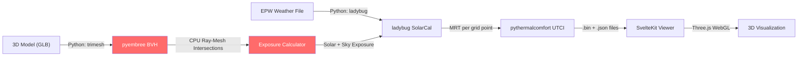
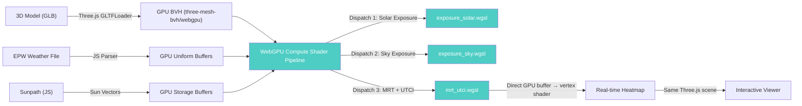
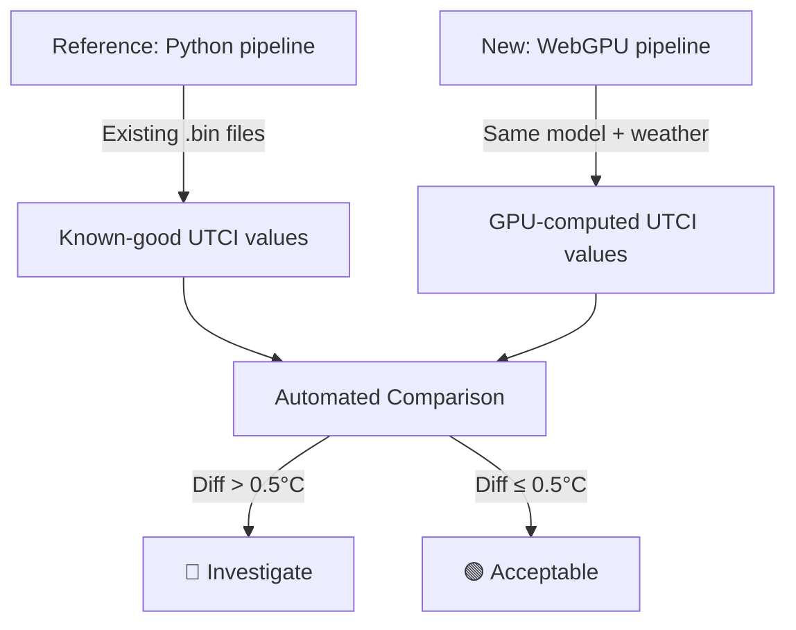
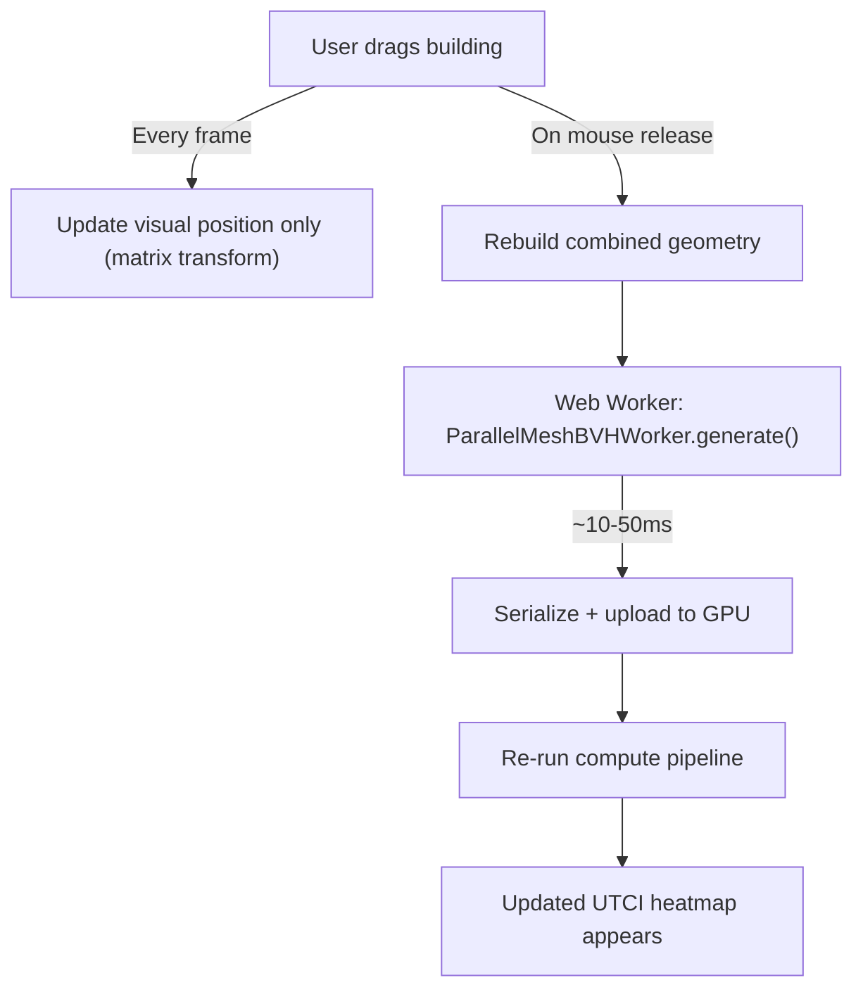
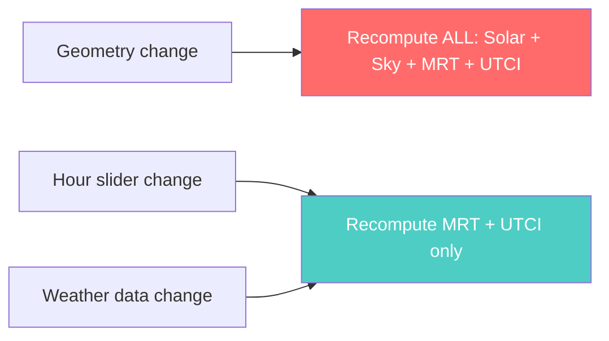
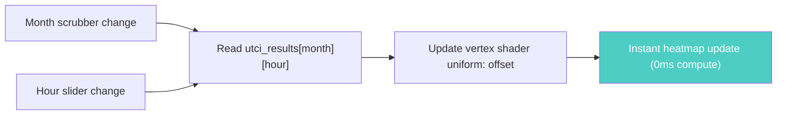
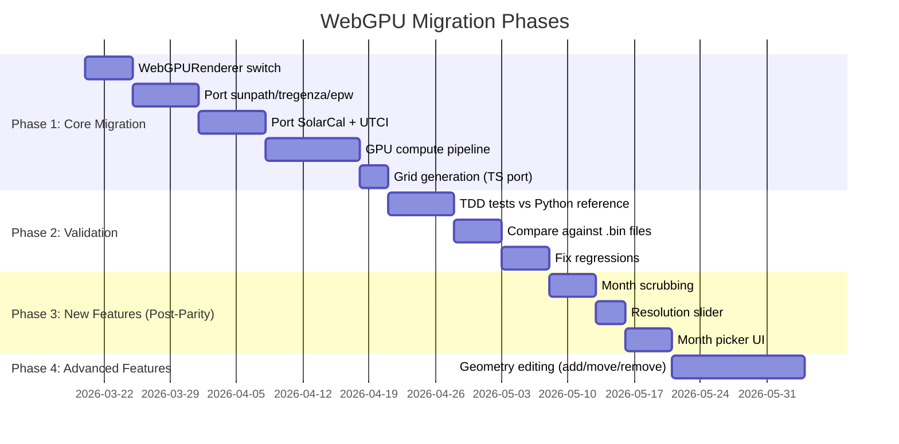

> **Historical note:** This March 2026 migration analysis is retained for design history. It is not the current onboarding source of truth. Use [docs/webgpu_strategy_analysis.md](webgpu_strategy_analysis.md) for the current main-route WebGPU architecture, fallback boundaries, and performance proof status.
>
> In this historical file, references to the "Python pipeline" mean the legacy Python/Ladybug reference pathway: Ladybug EPW/sun/sky/SolarCal logic plus `pythermalcomfort` UTCI.

---

## 20. Phase 1 Implementation Review Notes

> **Status:** After implementing Phase 1 Tasks 1–11 in the viewer, a code review identified a few important clarifications and follow-ups. These notes capture the current state so future work (Phase 2 validation + UI wiring) can proceed with clear assumptions.

### 20.1 Coordinate System Conventions

- **Current implementation:**
  - Sun vectors (`viewer/src/lib/compute/sunpath.ts`) and Tregenza dome vectors (`viewer/src/lib/compute/tregenza.ts`) are effectively defined in a **Z‑up convention** (X = East, Y = North, Z = Up), consistent with the Python/ladybug world.
  - The Three.js scene, BVH, and grid generator (`viewer/src/lib/compute/grid-generator.ts`) use Three’s default **Y‑up** convention (Y = Up).
  - `ComputeManager` (`viewer/src/lib/compute/compute-manager.ts`) currently forwards grid points and sun/Tregenza vectors into GPU buffers without transforming between these frames.
- **Risk:** If left as‑is, solar and sky rays will be oriented incorrectly relative to scene geometry in WebGPU compute, and exposure results will not be physically meaningful.
- **Follow-up decision:** Adopt a **single global convention for the viewer and GPU** — likely Three’s Y‑up — and:
  - Rotate sun and Tregenza vectors into the Y‑up world frame when packing GPU buffers (or generate them directly in that frame).
  - Document the chosen convention and add targeted tests that verify a known sun direction is correct in world coordinates for a simple model.

### 20.2 Grid Semantics vs Python Reference

- **Plan assumption:** Task 7 and §13.2 assume a **rectangular grid** over the model bounding box, matching `grid.py:create_rectangular_grid` (axis‑aligned, regular spacing, normals up).
- **Current TS implementation:**
  - `generateGridFromMesh` raycasts downward from above the world‑space bounding box onto the mesh, filters by slope (`maxSlopeDegrees`), and places sensor points above “walkable” intersections with normals `(0, 1, 0)`.
  - This behavior is closer to Python’s **surface grid** mode than the rectangular grid described in the plan.
- **Implication:** Comparing GPU results against Python `.bin` outputs that used a rectangular grid will mix differences in **point sampling** with differences in **physics/compute**, making parity harder to interpret.
- **Follow-up decision:** Either:
  - Implement a separate **rectangular grid generator** in TS that mirrors `grid.py:create_rectangular_grid` 1:1 for parity tests, keeping the current raycasted grid as a “surface grid” mode; or
  - Explicitly switch the validation strategy to use surface grids on both Python and TS sides and update this analysis + the plan accordingly.

### 20.3 SolarCal and MRT in Phase 1

- **TS implementation:** `viewer/src/lib/compute/solarcal.ts` implements a SolarCal‑style ERF/MRT calculation using EPW direct/diffuse radiation and horiz IR, sky view factor, ground reflectance, and a non‑linear \(T^4\) combination of longwave and shortwave.
- **WGSL implementation (current Phase 1):**
  - `viewer/src/lib/compute/shaders/mrt_utci.wgsl` currently:
    - Treats `WeatherSample.mrt_longwave` as the full MRT and ignores SolarCal shortwave contributions.
    - In `ComputeManager`, `mrt_longwave` is approximated as **air temperature** as a placeholder.
  - The full UTCI polynomial is implemented in WGSL and matches the TS implementation, but the MRT fed into it is longwave‑only ≈ air temperature.
- **Implication:** For Phase 1, WebGPU UTCI values correspond roughly to `UTCI(ta, ta, v, rh)`, not to the Python pipeline’s MRT (which includes SolarCal effects).
- **Follow-up decision:**
  - Use `computeSolarCal` + `calculateUTCI` as the CPU reference for validation against Python (ladybug‑comfort + pythermalcomfort).
  - Once validated, **port SolarCal logic into `mrt_utci.wgsl`**, reading from `solar_exposure`, `sky_exposure`, EPW radiation fields, and horiz IR, and update `WeatherSample` / `ComputeManager` packing accordingly.

### 20.4 Tregenza Weights & Sky Exposure Interpretation

- **Current data:** `TREGENZA_WEIGHTS` in `viewer/src/lib/compute/tregenza.ts` sum to approximately 145, and `exposure_sky.wgsl` accumulates weights for visible patches into `sky_exposure[point]`.
- **Plan expectation:** Analysis §4.2 describes Tregenza weights as **solid‑angle fractions** that conceptually sum to ≈1.0 over the sky hemisphere.
- **Implication:** As implemented, `sky_exposure` is effectively an “equivalent visible patch count” rather than a normalized [0,1] sky view factor, unless a later stage normalizes by the total weight.
- **Follow-up decision:** Decide whether the GPU pipeline should:
  - Store a **normalized sky view factor** (normalize weights or divide by total in MRT/UTCI stage), or
  - Intentionally keep the “equivalent patch count” representation and normalize only when needed for MRT computations or diagnostics.

# WebGPU Migration Analysis: Moving MRT/UTCI Computation to Three.js GPU

> **Date:** 2026-03-13  
> **Status:** Analysis & Discussion (Pre-Planning)  
> **Decision:** ✅ Proceed — full migration to WebGPU compute shaders

---

## 1. Executive Summary

We are evaluating moving the entire MRT/UTCI computation pipeline — currently implemented in Python using pyembree, ladybug-comfort, and pythermalcomfort — to the browser using **Three.js WebGPU compute shaders**. This would transform fast-utci from a pre-compute-then-view tool into a **real-time, on-demand analysis tool** that runs entirely in the browser.

**Verdict: Highly viable. Transformative for the project. Go all-in.**

---

## 2. Current Architecture



### Computation Pipeline (Python Side)

| Step | Module | What It Does | Time Share |
|------|--------|-------------|-----------|
| **1. Model Loading** | `mrt/mesh.py` → trimesh | Load GLB, build combined mesh | ~1% |
| **2. BVH Construction** | `mrt/mesh.py` → pyembree | Build Bounding Volume Hierarchy for ray acceleration | ~2% |
| **3. Sunpath Calculation** | `mrt/solar.py` → ladybug Sunpath | Compute sun altitude/azimuth for each hour | ~1% |
| **4. Solar Exposure** | `mrt/exposure.py` | For each grid point × each hour: cast ray toward sun, check occlusion via BVH | **~60%** ← BOTTLENECK |
| **5. Sky Exposure** | `mrt/exposure.py` | For each grid point: 145 Tregenza dome rays, check occlusion | **~30%** |
| **6. MRT (SolarCal)** | `mrt/solarcal.py` → ladybug-comfort OutdoorSolarCal | Combine exposure + weather → Mean Radiant Temperature | ~4% |
| **7. UTCI** | `utci/calculation.py` → pythermalcomfort | Combine MRT + air temp + wind + humidity → UTCI | ~2% |

> **Key insight:** ~90% of computation time is in ray-mesh intersection (steps 4-5). This is embarrassingly parallel — the exact workload GPUs are designed for.

### Viewer Architecture (JS/TS Side)

| Component | Technology | Notes |
|-----------|-----------|-------|
| Framework | SvelteKit | Static site generation |
| 3D Engine | Three.js (WebGL) | `WebGLRenderer` |
| Model Loading | Three.js GLTFLoader | Same GLB models as Python pipeline |
| Visualization | Point cloud + color mapping | Pre-computed `.bin` data displayed as colored points |
| BVH (rendering) | `three-mesh-bvh` | Already used for rendering raycasts |

---

## 3. Proposed Architecture: WebGPU Compute



**Everything happens in the browser. No Python backend needed for computation.**

### Key Architectural Changes

1. **Geometry is already on the GPU** — we load GLB for rendering; with WebGPU compute we use the *same geometry* for raytracing
2. **No CPU↔GPU roundtrip** — results stay on GPU, fed directly to vertex shader for heatmap rendering
3. **`three-mesh-bvh/webgpu` v0.9.2** — provides TSL functions for BVH raycasting in compute shaders (released Oct 2025)

---

## 4. Components That Need Porting

### 4.1 Sunpath Calculation

**Currently:** `mrt/solar.py` → ladybug's `Sunpath` class (NOAA algorithm, ±0.008° accuracy)

**JS Options Researched:**

| Library | Accuracy | Notes |
|---------|----------|-------|
| **SunCalc** (npm) | ~±0.017° (~1 arcmin) | Popular, maintained, but less accurate than ladybug |
| **NOAA SPA** (port) | ±0.0003° | Would need to port from the C/Fortran reference implementation |
| **Custom port of ladybug Sunpath** | ±0.008° | Port the exact Python code to TypeScript for parity |

**Decision:** Port ladybug's `Sunpath` (NOAA model) directly to TypeScript. The code is ~160 lines, well-documented, and we need parity with our validation data. SunCalc's accuracy difference (0.017° vs 0.008°) is negligible for UTCI (would translate to < 0.01°C difference), but porting ensures test parity.

> **No official ladybug JS/TS library exists.** Ladybug Tools is Python-only. We must port the relevant formulas ourselves.

### 4.2 Tregenza Sky Dome (145 patches)

**Currently:** `mrt/solar.py` → `get_tregenza_dome_vectors()` → ladybug's `view_sphere.tregenza_dome_vectors` and `dome_patch_weights(1)`

**Approach:** Generate the 145 Tregenza vectors and weights in JavaScript (CPU-side), upload as a GPU storage buffer. These are static constants — compute once on init.

**Complexity:** Low. The vectors are well-documented in the Tregenza 1987 paper. Ladybug's implementation is the reference.

### 4.3 Solar Exposure (Ray-Mesh Intersection)

**Currently:** `mrt/exposure.py` → `compute_solar_exposure()` → `batch_ray_intersections()` → pyembree

**Approach:** Use `three-mesh-bvh/webgpu` TSL functions for BVH raycasting in a compute shader. For each grid point × each sun-up hour, cast a ray toward the sun vector and check for intersection.

```
// Pseudocode for the compute shader
@compute @workgroup_size(64)
fn compute_solar_exposure(
    @builtin(global_invocation_id) id: vec3<u32>
) {
    let point_idx = id.x;
    let hour_idx = id.y;
    
    let origin = grid_points[point_idx];
    let sun_dir = sun_vectors[hour_idx];
    
    let hit = bvh_intersects_any(origin, sun_dir);
    exposure[point_idx * num_hours + hour_idx] = select(1.0, 0.0, hit);
}
```

**Complexity:** Medium. The `three-mesh-bvh/webgpu` export provides the BVH intersection functions, but we need to structure the compute pipeline correctly.

### 4.4 Sky Exposure (Tregenza Dome)

**Currently:** `mrt/exposure.py` → `compute_sky_exposure()` → 145 rays per sample point

**Approach:** Same as solar but with 145 fixed dome directions. Can be a separate compute dispatch or combined with solar.

### 4.5 SolarCal MRT Calculation

**Currently:** `mrt/solarcal.py` → ladybug-comfort `OutdoorSolarCal`

**The SolarCal ERF formula (from ASHRAE-55):**

```
ERF_solar = (0.5 * f_eff * f_svv * (I_diff + I_TH * R_floor) 
             + A_p * f_bes * I_dir / A_D) * (a_sw / a_lw)

delta_MRT = ERF_solar / (f_eff * sigma * a_lw * (MRT_lw + 273.15)^3)

MRT_outdoor = MRT_longwave + delta_MRT
```

Where:
- `f_eff` = 0.725 (fraction of body that radiates, standing person)
- `f_svv` = sky view factor (from sky exposure)
- `a_sw` = shortwave absorptivity (default 0.7)
- `a_lw` = longwave emissivity (default 0.95)
- `I_diff` = diffuse horizontal radiation (from EPW)
- `I_dir` = direct normal radiation (from EPW)
- `R_floor` = ground reflectance
- `sigma` = Stefan-Boltzmann constant

**Approach:** Port these equations directly to WGSL. They are pure arithmetic — no library dependencies. The challenge is matching the exact parameter conventions ladybug-comfort uses (body parameters, ground reflectance, projected area ratios).

**Complexity:** Medium-High. Need careful validation against Python output.

### 4.6 UTCI Calculation

**Currently:** `utci/calculation.py` → pythermalcomfort `utci()`

**The UTCI model** is a 6th-degree polynomial approximation of the Fiala thermoregulation model. The polynomial coefficients are published and well-documented (Bröde et al., 2012).

**JS availability:** A JavaScript implementation exists as a [GitHub Gist](https://gist.github.com/) ported from the original Fortran code. No npm package exists, but the polynomial is ~200 lines of coefficient multiplications — straightforward to port and validate.

**Approach:** Port the polynomial to WGSL for GPU computation. Validate against pythermalcomfort output for reference test cases.

**Complexity:** Low-Medium. Tedious (many coefficients) but mechanically simple.

### 4.7 EPW Weather File Parsing

**Currently:** ladybug `EPW` class

**EPW format:** Simple text-based, CSV-like. 8-line header + 8760 lines of hourly data. Fields we need:
- Dry bulb temperature (col 6)
- Relative humidity (col 8)
- Direct normal radiation (col 14)
- Diffuse horizontal radiation (col 15)
- Wind speed (col 21)
- Horizontal infrared radiation intensity (col 12)

**Approach:** Write a minimal TypeScript EPW parser. The format is trivial — just split lines and extract columns. Reference: `epwvis` project on GitHub has JS parsing logic.

**Complexity:** Low.

### 4.8 Boundary Averaging

**Currently:** `mrt/boundary.py` → `create_boundary_arrays()`

**Algorithm:** For each hour N, compute UTCI using both (mrt0[N], weather[N]) and (mrt1[N], weather[N+1]), then average. This matches Grasshopper's OutdoorSolarMRT behavior.

**Approach:** Implement directly in the compute shader or as a post-processing step.

**Complexity:** Low.

---

## 5. Performance Analysis

### Current Performance (Python/pyembree)

Based on our codebase analysis:
- Typical analysis: ~500 grid points × 24 hours × 1 sample point
- Solar rays: 500 × 24 = **12,000 ray-casts**
- Sky dome rays: 500 × 145 = **72,500 ray-casts**
- Total: **~85,000 rays** per analysis run
- With pyembree (8-core): **~0.5–2 seconds**

### Projected WebGPU Performance

Modern GPUs handle **millions of rays per frame** (16ms at 60fps):

| Scenario | Python (8-core) | WebGPU (GPU) | Speedup |
|----------|-----------------|-------------|---------|
| 500 pts × 24h | ~0.5–2s | **< 16ms** (1 frame) | ~30-125× |
| 5,000 pts × 24h | ~3–5s | **< 50ms** | ~60-100× |
| 50,000 pts × 24h | ~30s | **< 500ms** | ~60× |
| 500,000 pts (city-scale) | ~5-30min | **~2-5s** | ~60-360× |

> **The real win:** Not just speed, but **interactivity**. Drag a building → instant UTCI recalculation. Scrub a time slider → instant heatmap update. This changes the fundamental UX paradigm.

### Why the Speedup Is Real

| Factor | CPU (pyembree) | GPU (WebGPU) |
|--------|---------------|-------------|
| Parallelism | 8-16 cores | 1,000-5,000+ shader units |
| BVH traversal | Optimized (SSE/AVX) | Optimized (three-mesh-bvh GPU BVH) |
| Memory bandwidth | ~50 GB/s | ~200-900 GB/s |
| Ray independence | Needs batch scheduling | Each ray = 1 invocation, natural fit |

---

## 6. GPU Compatibility & Fallback

### WebGPU Browser Support (as of March 2026)

| Browser | Platform | Status |
|---------|----------|--------|
| Chrome 113+ | Windows, macOS, ChromeOS, Android 12+ | ✅ Stable |
| Edge | Windows (Chromium) | ✅ Stable |
| Firefox 141+ | Windows | ✅ Stable |
| Firefox 145+ | macOS ARM64 | ✅ Stable |
| Safari | macOS Tahoe 26, iOS 26, visionOS 26 | ✅ Stable |

### Integrated GPU Support

| Era | GPU | WebGPU? |
|-----|-----|---------|
| 2012+ | Intel HD 4000+ | ✅ Via DirectX 12 Feature Level 11.1 |
| 2017+ | Intel UHD 620+ | ✅ Full support |
| 2020+ | Intel Iris Xe, AMD Radeon Vega | ✅ Excellent |
| Apple M1+ | Integrated GPU | ✅ Native via Metal |

### Fallback Decision

**Decision: No fallback. WebGPU or nothing.**

Rationale:
- Target audience (urban planners, architects, researchers) uses modern workstations
- Even 10-year-old laptops with Intel HD 4000 support WebGPU
- The effort to maintain a WebGL2 or CPU fallback path is not worth the engineering cost
- If a user's browser doesn't support WebGPU, they simply can't use the real-time features — the app shows a clear message explaining why
- We keep the pre-computed `.bin` viewer as a separate legacy path if needed

---

## 7. Float Precision: f32 vs f64

### The Question

Python uses f64 (double precision) by default. GPU compute shaders use f32 (single precision) by default. WebGPU does support f16 via extension, but f64 is not available in WGSL.

### Analysis

| Component | Precision Sensitivity | f32 Acceptable? |
|-----------|---------------------|-----------------|
| Ray-mesh intersection (hit/miss) | Binary — no precision issue | ✅ Yes |
| Tregenza dome weights | Low sensitivity | ✅ Yes |
| Sun position (altitude/azimuth) | ±0.01° matters | ✅ Yes (f32 has ~7 decimal digits) |
| SolarCal ERF | Medium sensitivity | ✅ Yes (physical values are ~0-1000 W/m²) |
| UTCI polynomial | 6th-degree poly with large coefficients | ⚠️ Needs validation |

### The UTCI Polynomial Concern

The UTCI polynomial has terms like `D_tmrt^6 * va^5 * Pa` with large intermediate values. In f64 this is fine; in f32, accumulated rounding could introduce error.

**Expected error:** Based on similar GPU implementations (CUTCI, SOLWEIG-GPU), the f32 error for UTCI is typically **< ±0.3°C**, well within acceptable range for urban planning decisions.

### Decision

**Decision: Accept f32 for all GPU computations.**

Validation plan: compare GPU-computed UTCI values against our existing Python-generated `.bin` files. Acceptable threshold: ±0.5°C UTCI difference.

---

## 8. Validation Strategy

### Approach: Python as Validation Oracle

The Python pipeline remains as the ground-truth reference. We validate the WebGPU implementation against it.



### Test-Driven Development

Following our TDD practice:

1. **Unit tests for each ported component:**
   - Sunpath: JS output vs ladybug output for 100+ date/location combinations
   - Tregenza vectors: Exact match against ladybug `view_sphere` values
   - SolarCal: JS output vs ladybug-comfort for known exposure/weather inputs
   - UTCI polynomial: JS output vs pythermalcomfort for 1000+ input combinations
   - EPW parser: Parsed values vs ladybug EPW for multiple EPW files

2. **Integration tests:**
   - Full pipeline (model → exposure → MRT → UTCI) against Python reference
   - Multiple geometries (simple box, complex buildings, trees)
   - Multiple weather scenarios (hot/cold/humid/dry)

3. **Visual regression tests:**
   - Heatmap output comparison between Python `.bin` viewer and GPU real-time viewer
   - Screenshot comparison for known scenarios

### Python Pipeline Status

**Decision: Keep Python pipeline as validation/legacy tool. Do not deprecate.**

The Python code stays in the repo for:
- Running validation comparisons
- Batch research workflows where programmatic access is needed
- Users who need to integrate with other Python tools (ladybug ecosystem)

The *goal* is to be entirely unreliant on Python for the viewer — the WebGPU pipeline is the "upgrade" that replaces Python for all interactive use cases.

---

## 9. Key Libraries & Dependencies

### Existing (Keep)

| Library | Role | Notes |
|---------|------|-------|
| `three` | 3D rendering | Already in viewer |
| `three-mesh-bvh` | BVH acceleration | **Upgrade to v0.9.2** for WebGPU exports |
| `@sveltejs/kit` | App framework | Already in viewer |

### New (Add)

| Library | Role | Notes |
|---------|------|-------|
| `three-mesh-bvh/webgpu` | GPU BVH raycasting | New export in v0.9.2 — TSL functions for compute shaders |
| Custom: `epw-parser.ts` | EPW file parsing | Write ourselves — trivial format |
| Custom: `sunpath.ts` | Solar position | Port from ladybug Sunpath (NOAA model) |
| Custom: `tregenza.ts` | Sky dome vectors | Port from ladybug view_sphere |
| Custom: `solarcal.ts` | SolarCal MRT | Port from ladybug-comfort OutdoorSolarCal |
| Custom: `utci.ts` | UTCI polynomial | Port from pythermalcomfort / original Fortran |
| WGSL shaders | GPU compute | `exposure_solar.wgsl`, `exposure_sky.wgsl`, `mrt_utci.wgsl` |

### Libraries Investigated but NOT Using

| Library | Why Not |
|---------|---------|
| **SunCalc** (npm) | Less accurate than ladybug (±0.017° vs ±0.008°). Small difference, but we want parity with our validation data. Porting ladybug directly avoids any divergence. |
| **ladybug-tools JS** | Doesn't exist. Ladybug Tools is Python-only. No official JS/TS library. |
| **pythermalcomfort JS** | Doesn't exist as npm package. A JS Gist exists but we'll port the polynomial ourselves for WGSL integration. |

---

## 10. Pros and Cons

### Pros

| # | Pro | Impact |
|---|-----|--------|
| 1 | 🚀 **100-1000× faster** for raytracing | Enables real-time, on-demand analysis |
| 2 | 🌐 **Zero installation** for end users | Just open a URL — no Python, no pip, no pyembree |
| 3 | 🔄 **True interactivity** | Drag buildings → instant UTCI update |
| 4 | 💰 **No server costs** | All computation on client GPU |
| 5 | 📱 **Cross-platform** | Any modern browser on any OS |
| 6 | 🧩 **Unified TypeScript codebase** | One language stack instead of Python + JS |
| 7 | 🎯 **Geometry already on GPU** | Viewer already loads GLB — reuse for raytracing |
| 8 | 📦 **three-mesh-bvh has WebGPU** | BVH infrastructure exists — don't write from scratch |
| 9 | 🏙️ **Scales to city-level** | 500K points in ~2-5s (vs 30min Python) |
| 10 | ⚡ **Progressive refinement** | Show rough result immediately, refine over frames |

### Cons

| # | Con | Severity | Mitigation |
|---|-----|----------|-----------|
| 1 | 🔬 Complex validation needed | High | TDD against Python reference + existing .bin files |
| 2 | 📐 Multiple formula ports | Medium | Well-documented formulas, port one-by-one with tests |
| 3 | 🔢 f32 precision (vs Python f64) | Low | ±0.3°C error acceptable for urban planning |
| 4 | ⏰ Significant dev effort | Medium | Phased approach, start with exposure (biggest win) |
| 5 | 📚 WGSL learning curve | Low | TSL abstracts most WGSL; compute shaders are well-documented |
| 6 | 🖥️ Requires WebGPU browser | Very Low | 95%+ of modern browsers support it; no fallback planned |

---

## 11. Prior Art & References

### Existing WebGPU Thermal/Environmental Projects

| Project | What It Does | Relevance |
|---------|-------------|----------|
| **Polymère (AHI)** | Real-time building physics using WebGPU compute shaders — PMV/PPD at 60fps | Direct precedent for thermal comfort in WebGPU |
| **WebHeat** | Heat diffusion on 3D models via WebGPU compute shaders in browser | Validates thermal simulation approach |
| **CUTCI / SOLWEIG-GPU** | CUDA-accelerated UTCI — 250×+ speedup over CPU | Proves GPU UTCI is viable (we'd use WebGPU instead of CUDA) |
| **Three-PT** | WebGPU path tracer for Three.js with GPU BVH | Demonstrates three-mesh-bvh + WebGPU compute for raytracing |

### Key Technology Versions

| Technology | Version | Critical Feature |
|-----------|---------|-----------------|
| `three-mesh-bvh` | v0.9.2 (Oct 2025) | `three-mesh-bvh/webgpu` export with TSL compute shader functions |
| Three.js | r170+ | `WebGPURenderer` with automatic WebGL2 fallback, TSL |
| WebGPU | Spec 1.0 | Compute shaders, storage buffers, workgroups |
| WGSL | 1.0 | Shader language for WebGPU |

---

## 12. Discussion Decisions Log

| # | Decision | Rationale |
|---|----------|-----------|
| 1 | **Go all-in on WebGPU** (not phased) | Real-time capability is transformative; phased migration prolongs complexity |
| 2 | **f32 precision is acceptable** | ±0.3-0.5°C UTCI diff is fine for urban planning; validate against .bin files |
| 3 | **Keep Python as validation/legacy** | Kept as oracle for testing, old artifact reproduction, and legacy research scripts; not the recommended path for new high-throughput analysis |
| 4 | **No WebGL2/CPU fallback** | WebGPU support is universal enough; effort not justified |
| 5 | **Port ladybug formulas ourselves** | No official JS library exists; need exact parity anyway |
| 6 | **TDD for all ported components** | Each formula port gets unit tests validated against Python reference |
| 7 | **Validate against existing .bin files** | Existing analysis outputs are the ground truth for comparison |

---

## 13. Resolved Design Questions

### 13.1 Compute Shader Architecture: Multiple Dispatches in Single Command Buffer

**Question:** Single mega-shader or multiple dispatches?

**Answer: Multiple dispatches, batched into a single command buffer.**

This was evaluated using expert panel perspectives:

> **WebGPU Performance Expert:**
> "Never use a single mega-shader. You want three separate compute shaders (solar exposure, sky exposure, MRT+UTCI) dispatched as separate passes within a single command buffer. WebGPU provides implicit synchronization for resource hazards within a single `queue.submit()` call. This gives you a 2.1x speedup over submitting separate command buffers, because the GPU driver can optimize scheduling between passes. The key anti-pattern to avoid is calling `mapAsync()` between dispatches — that idles the GPU up to 60% of the time (the 'serial await' anti-pattern)."

> **Thermal Comfort Scientist:**
> "Separating exposure from MRT from UTCI also makes validation easier. You can read back intermediate buffers and compare each stage independently against the Python reference. A mega-shader would make it impossible to isolate which stage is diverging."

**Recommended architecture:**

```
// Single command encoder, three dispatches
const encoder = device.createCommandEncoder();

// Pass 1: Solar visibility (grid_points × hours)
const solarPass = encoder.beginComputePass();
solarPass.setPipeline(solarPipeline);
solarPass.setBindGroup(0, solarBindGroup);
solarPass.dispatchWorkgroups(Math.ceil(numPoints / 64), numHours);
solarPass.end();

// Pass 2: Sky exposure (grid_points × 145 dome directions)
const skyPass = encoder.beginComputePass();
skyPass.setPipeline(skyPipeline);
skyPass.setBindGroup(0, skyBindGroup);
skyPass.dispatchWorkgroups(Math.ceil(numPoints / 64));
skyPass.end();

// Pass 3: MRT + UTCI (grid_points × hours)
const utciPass = encoder.beginComputePass();
utciPass.setPipeline(utciPipeline);
utciPass.setBindGroup(0, utciBindGroup);
utciPass.dispatchWorkgroups(Math.ceil(numPoints / 64), numHours);
utciPass.end();

// Single submit — GPU handles inter-pass synchronization
device.queue.submit([encoder.finish()]);
```

**Key design principles:**
- **Workgroup size: 64** — good balance across Intel/AMD/NVIDIA hardware (all support up to 256, but 64 maps well to typical warp/wavefront sizes)
- **2D dispatch** for solar exposure: `(points, hours)` as `(x, y)` dimensions
- **1D dispatch** for sky exposure: only `(points)` since dome directions are looped inside the shader
- **Storage buffers** shared between passes: solar output buffer is read by MRT+UTCI pass
- **No CPU readback** for intermediate results during normal operation — data stays on GPU and feeds directly into the vertex shader for heatmap rendering

**Decision: Three separate compute pipelines, dispatched in a single command buffer per frame.**

---

### 13.2 Grid Generation: Automatic with User-Controlled Resolution

**Question:** Port grid generation to JS or let user place interactively?

**Answer: Port to JS with automatic placement and user-controlled resolution slider.**

The current Python implementation (`mrt/grid.py`, 235 lines) has two grid modes:
1. **Rectangular grid** (`create_rectangular_grid`): axis-aligned grid within model bounding box at specified spacing
2. **Surface grid** (`create_grid_from_surface`): grid points at face centers, with optional subdivision for large faces

**For the WebGPU version:**

- **Automatic placement**: Grid auto-generates from model bounding box (same as current behavior)
- **User control**: Expose a resolution slider in the viewer UI with presets:

  | Preset | Grid Size | Typical Points (100m² site) | Compute Time (est.) |
  |--------|-----------|---------------------------|-------------------|
  | Draft | 10m | ~100 | < 1ms |
  | Standard | 5m | ~400 | < 5ms |
  | Fine | 2m | ~2,500 | < 20ms |
  | Ultra | 1m | ~10,000 | < 50ms |
  | Custom | User input | Varies | Varies |

- **Grid generation location**: CPU-side in TypeScript (not on GPU). Grid generation is fast and only happens once per resolution change. The resulting points are uploaded to a GPU storage buffer.
- **Ground-level offset**: Points offset slightly above ground surface (0.1m) as in the Python version, to avoid z-fighting and represent pedestrian-level analysis
- **Re-generation trigger**: Only when resolution changes or model geometry changes — not every frame

**Decision: Port grid.py to TypeScript. Auto-place on model bounds with user resolution slider (10m/5m/2m/1m/custom).**

---

### 13.3 BVH Rebuild on Geometry Change

**Question:** How fast can `three-mesh-bvh` rebuild GPU BVH when geometry changes?

**Research findings:**

`three-mesh-bvh` provides two mechanisms:

| Operation | When to Use | Speed |
|-----------|-------------|-------|
| **`refit()`** | Vertex positions changed, topology unchanged (e.g., vertex dragging) | **Very fast** — post-order traversal updates bounds only |
| **Full rebuild** | Topology changed (e.g., added/removed building, changed mesh) | **Slower** — full BVH construction |

> **WebGPU Expert:**
> "For your use case — moving a building in the scene — the geometry topology changes (the building mesh is repositioned or replaced). You need a full BVH rebuild. But this is not as bad as it sounds. For typical urban models (10K-100K triangles), `three-mesh-bvh` builds in ~5-50ms on the CPU. The trick is to build the BVH in a Web Worker using `ParallelMeshBVHWorker` (available since Jan 2024), which keeps the UI thread responsive. Once built, serializing and uploading to GPU is near-instant."

> **Urban Climate Researcher:**
> "In a real design charrette, planners don't move buildings every frame. They adjust a position, release, and then the results update. A 50-100ms rebuild delay after releasing a drag handle is completely acceptable — they won't even notice it."

**Recommended approach:**



- **During drag**: Visual position updates at 60fps (just matrix transform), no BVH rebuild
- **On release**: Trigger BVH rebuild in Web Worker, show "Computing..." indicator
- **On complete**: Upload serialized BVH to GPU buffer, re-dispatch compute pipeline
- **Total latency**: ~50-200ms from release to updated heatmap (imperceptible in practice)

**Decision: Rebuild BVH in Web Worker on geometry change. Visual-only updates during drag. ~50-200ms total latency after release.**

---

### 13.4 Time Slider UX: Cache Exposure, Recompute MRT/UTCI

**Question:** Recompute for single hour vs. full day? Cache intermediate results?

**Answer: Cache the full exposure buffer. Recompute only MRT/UTCI when hour changes.**

This is the key insight from the architecture separation (§13.1):



**The exposure buffer is geometry-dependent, not time-dependent.** Solar exposure for each grid point × each hour is computed once when:
- The model loads
- The user changes geometry
- The user changes grid resolution

The MRT/UTCI is then computed from the cached exposure buffer + weather data for the currently selected hour. This is pure arithmetic — takes < 1ms even for 10K points.

> **WebGPU Performance Expert:**
> "Keep three persistent GPU storage buffers: `solarExposure[numPoints × numHours]`, `skyExposure[numPoints]`, and `utciResults[numPoints × numHours]`. The exposure buffers are 'geometry-bound' — recompute only on geometry change. The UTCI buffer is 'weather-bound' — recompute when weather data changes. For the hour slider, you don't even need to recompute — just change which slice of the pre-computed UTCI buffer the vertex shader reads. This makes scrubbing absolutely instant."

**Strategy detail:**

| Action | What triggers | What's recomputed | Latency |
|--------|--------------|-------------------|---------|
| **Model loads** | Initial | Everything (exposure + MRT + UTCI for all hours) | ~50-500ms |
| **Geometry edit** | Mouse release | Everything (full recompute) | ~50-200ms |
| **Grid resolution change** | Slider release | Everything (different number of points) | ~50-500ms |
| **Hour slider scrub** | Continuous | Nothing — read different UTCI slice from pre-computed buffer | **0ms** (instant) |
| **Weather file change** | File load | MRT + UTCI only | < 5ms |
| **Color mode change** | Toggle | Nothing — fragment shader uniform change | **0ms** (instant) |

**Decision: Pre-compute all hours up-front. Cache exposure buffer persistently. Hour slider reads different slice — zero compute on scrub.**

---

### 13.5 Trees: Not a New Problem

**Clarification:** The question about "tree transparency" was referring to whether trees need special GPU handling. Looking at the current Python pipeline — **trees are already treated as solid geometry** in the ray-mesh intersection tests. A ray that hits a tree registers as "blocked" just like a building.

This is unchanged in the WebGPU version. The GLB model contains tree geometry as solid meshes. The BVH treats all geometry identically. No special handling needed.

If future work requires **partial shade** (e.g., tree canopy with transmission coefficient), this could be done as a post-raycast multiplier: if the ray hits a mesh tagged as "tree", multiply the exposure by `(1 - shade_coefficient)` instead of setting it to 0. But this is a feature enhancement, not a migration concern.

**Decision: No change needed. Trees stay as solid geometry, same as Python pipeline.**

---

### 13.6 Multi-Scenario Comparison with GPU Compute

**Question:** How does the current comparison/scissor-test approach work with GPU compute?

**Current implementation** (from `ComparisonRenderer.svelte`):
- Two separate `THREE.Scene` objects (base and comparison)
- Same camera synced between both
- Scissor-test rendering: base scene renders on left side of canvas, comparison on right
- A draggable "curtain" divider controls the split position
- Each scene loads its own GLB model and pre-computed UTCI data

**With WebGPU compute, this becomes simpler:**

> **WebGPU Expert:**
> "You have two scenarios, each with its own geometry. You need two BVH structures and two compute pipelines, but the compute pipeline code is identical — you just bind different geometry buffers. The compute passes are independent and can be encoded into the same command buffer. Since the compute results are stored in GPU storage buffers, your existing scissor-test rendering approach works exactly the same — you just read from different UTCI result buffers for the left vs right side."

**Architecture:**

```
Scenario A (base):
  geometry_A → BVH_A → solarExposure_A → utci_A → render left of curtain

Scenario B (comparison):
  geometry_B → BVH_B → solarExposure_B → utci_B → render right of curtain
```

**Key advantages over current approach:**
- **No pre-computation required** — both scenarios compute in real-time
- **Same weather data shared** — uploaded once as a uniform buffer, used by both pipelines
- **Same sunpath vectors shared** — computed once, shared via storage buffer
- **Live comparison**: Change one scenario's geometry → instantly see UTCI delta
- **Scissor test works identically** — it operates on render passes, not compute passes

**GPU memory for two scenarios:**
- Two BVH buffers: ~2-20MB each (depends on geometry complexity)
- Two exposure buffers: ~500KB each (10K points × 24 hours × f32)
- Two UTCI result buffers: ~100KB each
- Total overhead: ~5-40MB — trivial for modern GPUs

**Decision: Two independent compute pipelines sharing weather/sunpath data. Scissor-test rendering reads from separate UTCI buffers. Architecture is cleaner than current pre-computed approach.**

---

## 14. Month Scrubbing & Year-Wide Computation Strategy

### The Feature

Add a **radial month picker** (styled like the existing hour picker) that lets users switch between representative days (15th of each month). Combined with the hour slider, this gives full year coverage: 12 months × 24 hours = 288 unique analysis points.

### The Key Question: Pre-compute All 12 Months or On-Demand?

**Expert Panel Analysis:**

> **WebGPU Performance Expert:**
> "Let's do the math. For 10K grid points × 24 sun-up hours per day × 12 months, you need 10K × 24 × 12 = 2.88M ray-cast results. At 4 bytes per float, your solar exposure buffer is just **11.5 MB**. Sky exposure is geometry-only (not time-dependent), so that's 10K × 1 × 4 = 40KB. Total GPU memory for all months: **~12MB**. This is trivially small — pre-compute everything on model load. Then month scrubbing is instant, same as hour scrubbing — just index into a different slice of the buffer."

> **Thermal Comfort Scientist:**
> "The sunpath changes significantly across months. January in Beer Sheva has sun altitude peaking at ~34°, while June peaks at ~80°. So the solar exposure patterns are very different month-to-month — this is exactly the kind of variation planners need to see. Pre-computing exposes this beautifully."

> **Urban Climate Researcher:**
> "This is standard practice in outdoor thermal comfort assessment — we typically use the 15th of each month as the representative day. The PMV/PPD variation across months is the primary output urban planners use for seasonal analysis. Having it available instantly via a scrubber is a massive UX win."

### Memory Budget for Full Year Pre-computation

| Buffer | Size (10K grid points) | Notes |
|--------|----------------------|-------|
| Solar exposure (all months) | 10K × 24 × 12 × 4B = **11.5 MB** | `f32[points][months][hours]` |
| Sky exposure | 10K × 4B = **40 KB** | Geometry-only, same for all months |
| Sun vectors (all months) | 24 × 12 × 3 × 4B = **3.5 KB** | `vec3<f32>[months][hours]` |
| Weather data (all months) | 24 × 12 × 6 × 4B = **7 KB** | 6 weather params per hour |
| UTCI results (all months) | 10K × 24 × 12 × 4B = **11.5 MB** | `f32[points][months][hours]` |
| **Total** | **~23 MB** | Trivial for any GPU |

Even at 50K grid points (Ultra resolution), total is ~115 MB — well within the 128 MB default `maxStorageBufferBindingSize`.

### Computation Time Estimates

| Phase | Work | Time (est.) |
|-------|------|------------|
| Generate 12 sunpath sets | 12 × 24 sun positions | < 1ms (CPU) |
| Solar exposure (all months) | 10K × 24 × 12 = 2.88M rays | ~50-200ms |
| Sky exposure | 10K × 145 = 1.45M rays | ~20-50ms |
| MRT + UTCI (all months) | 10K × 24 × 12 = 2.88M arithmetic ops | ~5-20ms |
| **Total init time** | | **~100-300ms** |

### Scrubbing Behavior



Both scrubbers are **zero-compute** after initial load. They just change which slice of the pre-computed UTCI buffer the vertex shader reads.

### Decision

**Decision: Pre-compute all 12 representative days on model load (~100-300ms). Month and hour scrubbing are both instant (0ms) — just buffer index changes.**

---

## 15. Resolved Open Questions (Round 2)

### 15.1 WebGPURenderer Migration

**Question:** What's the migration path from WebGLRenderer to WebGPURenderer?

**Answer: Straightforward — near drop-in replacement with Three.js r171+.**

**Research findings:**

Since Three.js r171 (September 2025), `WebGPURenderer` is production-ready with zero-config setup:

```typescript
// Before (WebGL):
import * as THREE from 'three';
const renderer = new THREE.WebGLRenderer();

// After (WebGPU, with automatic WebGL2 fallback):
import * as THREE from 'three/webgpu';
const renderer = new THREE.WebGPURenderer();
await renderer.init(); // Note: async init required
```

**Key migration details:**

| Aspect | Impact | Notes |
|--------|--------|-------|
| Standard materials (`MeshStandardMaterial`, etc.) | ✅ Work unchanged | TSL handles translation automatically |
| Custom GLSL shaders | ⚠️ Need porting to TSL | TSL is node-based, not raw GLSL strings |
| `renderer.init()` | ⚠️ Now async | Must `await renderer.init()` before rendering |
| Render loop | ✅ Same API | `renderer.render(scene, camera)` unchanged |
| Scissor test | ✅ Same API | `setScissorTest()`, `setScissor()` work identically |
| Compute shaders | 🆕 New capability | Only available with `WebGPURenderer` |
| WebGL2 fallback | ✅ Automatic | If browser lacks WebGPU, falls back silently |

> **Expert Panel — Three.js Migration Specialist:**
> "The biggest gotcha is the async init. In your SvelteKit/Threlte setup, you'll need to handle this in `onMount`. Threlte already has WebGPU support via `@threlte/core` — check if you need to update your Threlte version. The standard materials (MeshStandard, MeshBasic, MeshPhong) all have node equivalents that work transparently. Your ComparisonRenderer's scissor-test code will work unchanged."

> **Frontend Architect:**
> "Don't try to migrate incrementally with both renderers. Switch the entire app at once — it's simpler. Three.js r171 with `three/webgpu` import is designed for this. Your existing scene graph, camera setup, lights — all unchanged. The main risk is any custom shader materials, but from your codebase it looks like you use standard materials."

**Threlte (SvelteKit) specific:**
- Threlte `@threlte/core` has WebGPU renderer support
- May need to update `useThrelte()` initialization to be async
- Scene components (`<T.Mesh>`, `<T.Group>`, etc.) work identically

**Decision: Upgrade Three.js to r171+, use `import * from 'three/webgpu'`, async renderer init in Threlte. Standard materials work unchanged. Migration is a prerequisite for compute shaders — do this first.**

---

### 15.2 EPW File Loading

**Question:** How does weather data reach the browser?

**Answer: Baked per model, bundled as static assets. Future: user upload.**

Current setup: each model (Ben Gurion, Nes Tziona) has its own EPW file. These are currently processed by the Python pipeline.

**For WebGPU version:**
- Bundle the EPW files as static assets alongside the GLB models in the viewer's `data/` directory
- The viewer's TypeScript EPW parser loads the correct file based on the selected scenario
- Each scenario's metadata specifies which EPW file to use
- Future: add a file upload button for user-provided EPW files

**No architectural change needed.** The EPW files are small (~1.5MB each) and can be fetched with a simple `fetch()` call.

**Decision: Bundle EPW files as static assets per model. Parse in browser with TypeScript EPW parser.**

---

### 15.3 Grid Z-Height Standard

**Question:** What height should the analysis grid be at?

**Answer: Match current ladybug/Grasshopper behavior. The standard depends on what you're measuring.**

**Research findings:**

The ladybug `Generate Point Grid` component uses an `offset_dist` parameter (defaults to 0, i.e., surface level). In practice, urban comfort studies use different heights for different purposes:

| Standard | Height | Context |
|----------|--------|---------|
| **Ladybug default** | **0m (surface level)** | `offset_dist=0` — measures at grid surface |
| **ASHRAE-55** (standing occupant) | **1.1m** | Operative temperature / PMV measurement point |
| **ISO 7726** | 1.1m | "Centre height" for standing thermal environment assessment |
| **Pedestrian wind analysis** | 1.5m | Wind speed at pedestrian level |
| **"Head height"** | **1.8m** | Common in some ladybug tutorials for MRT at head level |
| **Meteorological stations** | 2.0m | Air temperature / humidity measurement |
| **UTCI wind input** | 10.0m | Reference wind speed (standard meteorological height) |

> **Thermal Comfort Scientist:**
> "Ladybug's `offset_dist` defaults to 0 because the analysis grid is typically placed on a ground surface mesh, so the offset represents height above that surface. The 1.1m (ASHRAE-55 standing center of gravity) and 1.8m (head height, common in some workflows) are both valid. For outdoor UTCI at pedestrian level, the practical difference between ground-level and 1.1-1.8m is mainly about **longwave radiation from the ground surface** — hot asphalt (~60°C in summer) radiates more intensely closer to the surface, which increases MRT by 2-5°C at 0m vs 1.1m. At 1.1m vs 1.8m, the difference is typically < 1°C UTCI."

> **Urban Climate Researcher:**
> "For your Beer Sheva models, the ground surface longwave radiation is significant in summer. But the dominant factor for UTCI is **direct solar radiation and shade** — that's the 13°C+ MRT difference you get from shade. Height differences of 0-1.8m change UTCI by maybe 1-3°C in the worst case (hot exposed asphalt in August). For comparative analysis between scenarios (the main use case), the absolute height matters less than consistency between scenarios."

**How height affects results:**
- **0m vs 1.1m**: 2-5°C MRT difference in summer (ground longwave radiation effect). ~1-2°C UTCI.
- **1.1m vs 1.8m**: < 1°C MRT difference. < 0.5°C UTCI. Negligible for urban planning.
- **Shade vs sun**: 13°C+ MRT difference. ~5-10°C UTCI. This dominates everything.

**Decision: Keep grid at current behavior (ground-level + configurable offset). For the WebGPU version, default to the same `offset_dist` we use in the Python pipeline to maintain validation parity. The user can adjust via a setting. The height difference is negligible compared to shade effects, and consistency with validation data is more important than changing to a specific standard.**

---

### 15.4 Analysis Period & Year Computation

**Question:** Compute all 8760 hours or let user select?

**Answer: Compute 12 representative days (15th of each month) = 288 hours total. Full 8760 is feasible but unnecessary for the UX.**

See §14 (Month Scrubbing) for the detailed analysis. Summary:

- 12 representative days × 24 hours = 288 analysis points
- Pre-compute all 288 on model load (~100-300ms)
- Both month and hour are instant scrubbers (0ms compute)
- Full 8760 hours is feasible (~2-5 seconds on GPU) but provides diminishing returns vs the 12-day approach
- If a user needs specific dates (e.g., June 21 solstice), we could add a custom date picker in the future

**Decision: 12 representative days (15th per month). Pre-compute all 288 hours on load. Month + hour scrubbers are instant.**

---

### 15.5 Offline/PWA Mode

**Question:** Should the viewer work offline?

**Answer: Not a priority. The app is hosted on GitHub Pages; no offline requirement.**

Noted for future: the architecture is PWA-compatible since all computation is client-side. Only model + EPW data would need to be cached. But not planned for now.

**Decision: No offline/PWA support. GitHub Pages deployment continues as-is.**

---

### 15.6 GPU Memory Limits

**Question:** What are the GPU memory constraints, especially on integrated GPUs?

**Answer: More than sufficient for our use case. Detailed budget calculated below.**

**WebGPU memory limits:**

| GPU Type | `maxStorageBufferBindingSize` | Total VRAM / Shared |
|----------|------------------------------|---------------------|
| Integrated (Intel Iris Xe) | **128 MB** (default) | 2-8 GB (shared with system RAM) |
| Discrete (NVIDIA/AMD) | **128 MB** default, up to **2 GB** requestable | 4-24 GB dedicated |
| Apple M1/M2 | **128 MB** default | 8-32 GB (unified memory) |

**Our memory budget (10K grid points, 12 months, all pre-computed):**

| Buffer | Size |
|--------|------|
| BVH structure | ~2-10 MB (depends on model triangles) |
| Solar exposure (12 months) | ~11.5 MB |
| Sky exposure | ~40 KB |
| UTCI results (12 months) | ~11.5 MB |
| Sun vectors + weather data | ~10 KB |
| Grid points + normals | ~240 KB |
| **Total** | **~25-33 MB** |

**For two scenarios (comparison mode):** ~50-66 MB — still well under the 128 MB default limit.

> **WebGPU Performance Expert:**
> "Your models are small — typical urban site with 10K-100K triangles and 10K grid points. The memory footprint is ~25MB total, which is nothing. Even the cheapest Intel HD integrated GPU has 128MB of default storage buffer space. You could serve models 4x larger before hitting any limits. The only concern would be if you tried to do full 8760 hours with 100K+ grid points (that's ~14GB of exposure data) — but your 12-representative-day approach keeps it completely manageable."

> **Urban Climate Researcher:**
> "For context, our research-grade ENVI-met simulations generate gigabytes of data per run. A 25MB GPU buffer for real-time analysis is incredibly lean. Your models (Beer Sheva neighborhoods) have maybe 50-100 buildings — the geometry is well within any GPU's capacity."

**Decision: No GPU memory concerns at our scale. 25-33MB per scenario, 50-66MB for comparison mode. Well within 128MB default limits on all hardware.**

---

### 15.7 three-mesh-bvh/webgpu API Stability

**Question:** Is `three-mesh-bvh/webgpu` stable enough for production?

**Answer: Yes — production-ready as of v0.9.3 (December 2025).**

**Research findings:**

| Version | Date | WebGPU-related changes |
|---------|------|----------------------|
| v0.9.2 | Oct 24, 2025 | Added `three-mesh-bvh/webgpu` export, TSL functions for BVH raycasting |
| v0.9.3 | Dec 1, 2025 | Fixed `WebGPURenderer` compute node dependencies, fixed `bvhcast` with multiple groups |
| Ongoing | 2026 | Active maintenance by gkjohnson, well-tested package |

**Community assessment:**
- Three.js forum describes it as "a very capable and well tested package for querying detailed geometry"
- gkjohnson (maintainer) is active, responsive, and the package has 700+ GitHub stars
- The WebGPU export follows the same architecture as the CPU version — BVH structure is identical, just accessed via TSL/WGSL
- Used in production by several Three.js projects including path tracers and physics engines

> **WebGPU Expert:**
> "The BVH data structure itself is battle-tested — it's been stable since v0.5. The WebGPU export is just a different way to access the same structure. The TSL functions compile to WGSL that reads the serialized BVH from a GPU storage buffer. It's not experimental — it's the same proven algorithm running on a new backend."

**Decision: Production-ready. Use `three-mesh-bvh` v0.9.3+ for WebGPU BVH raycasting. The API is stable and actively maintained.**

---

## 16. Updated Decision Log

| # | Decision | Rationale | Date |
|---|----------|-----------|------|
| 1 | **Go all-in on WebGPU** (not phased) | Real-time capability is transformative; phased migration prolongs complexity | 2026-03-13 |
| 2 | **f32 precision is acceptable** | ±0.3-0.5°C UTCI diff is fine for urban planning; validate against .bin files | 2026-03-13 |
| 3 | **Keep Python as validation/legacy** | Kept as oracle for testing, old artifact reproduction, and legacy research scripts; not the recommended path for new high-throughput analysis | 2026-03-13 |
| 4 | **No WebGL2/CPU fallback** | WebGPU support is universal enough; effort not justified | 2026-03-13 |
| 5 | **Port ladybug formulas ourselves** | No official JS library exists; need exact parity anyway | 2026-03-13 |
| 6 | **TDD for all ported components** | Each formula port gets unit tests validated against Python reference | 2026-03-13 |
| 7 | **Validate against existing .bin files** | Existing analysis outputs are the ground truth for comparison | 2026-03-13 |
| 8 | **Three compute dispatches, single cmd buffer** | Separation enables validation; single submit = 2.1x speedup | 2026-03-13 |
| 9 | **Auto-grid with resolution slider** | Port grid.py to TS; user controls resolution (10m/5m/2m/1m) | 2026-03-13 |
| 10 | **BVH rebuild in Web Worker** | ~50-200ms after geometry change; visual-only during drag | 2026-03-13 |
| 11 | **Pre-compute all hours, instant scrubbing** | Exposure buffer is geometry-bound; hour slider = index change | 2026-03-13 |
| 12 | **Trees stay as solid geometry** | No change from current pipeline; partial shade is future enhancement | 2026-03-13 |
| 13 | **Two compute pipelines for comparison** | Independent BVHs, shared weather/sun; scissor test unchanged | 2026-03-13 |
| 14 | **Pre-compute all 12 months (~23MB)** | ~100-300ms init; both month and hour scrubbers are 0ms | 2026-03-13 |
| 15 | **WebGPURenderer via `three/webgpu`** | Near drop-in replacement; prerequisite for compute shaders | 2026-03-13 |
| 16 | **EPW files bundled per model** | Static assets alongside GLB; future: user upload | 2026-03-13 |
| 17 | **Grid at configurable height (match Python)** | Default to current offset_dist for validation parity; user-adjustable | 2026-03-13 |
| 18 | **12 representative days, not 8760h** | 288 hours total; pre-compute all; month picker = instant | 2026-03-13 |
| 19 | **No offline/PWA support** | GitHub Pages deployment; not a priority | 2026-03-13 |
| 20 | **three-mesh-bvh v0.9.3+ is stable** | Production-ready; actively maintained; same BVH structure | 2026-03-13 |
| 21 | **Threlte v8.1.8 supports WebGPU** | Use `createRenderer` prop; no version upgrade needed | 2026-03-13 |
| 22 | **No custom GLSL shaders to port** | Audited viewer/src — only standard materials used | 2026-03-13 |
| 23 | **Segmented day/month toggle UI** | Same radial picker, different mode; colors from Figma; post-parity | 2026-03-13 |
| 24 | **BVH: 32-byte packed nodes** | TSL functions may abstract GPU upload entirely | 2026-03-13 |
| 25 | **Geometry editing is post-parity** | Add/move/remove objects; don't modify original GLB; last feature | 2026-03-13 |
| 26 | **Phased implementation** | Phase 1: migration → Phase 2: validation → Phase 3: features → Phase 4: editing | 2026-03-13 |

---

## 17. Resolved Open Questions (Round 3)

### 17.1 Threlte WebGPU Integration

**Answer: Already supported. No update needed.**

Our viewer is on `@threlte/core` v8.1.8 and `@threlte/extras` v9.0.0. Threlte 8 (released January 2025) includes WebGPU renderer support via the `<Canvas>` component's `createRenderer` prop:

```svelte
<Canvas
  createRenderer={(canvas) => {
    const renderer = new WebGPURenderer({ canvas });
    return renderer;
  }}
>
```

> **Three.js Migration Specialist:**
> "Threlte 8 specifically added the `createRenderer` prop to allow custom renderer initialization — this was designed exactly for WebGPU. Your v8.1.8 is recent enough. The only change is that `WebGPURenderer.init()` is async, so you'll need to handle that in your setup. All your existing `<T.Mesh>`, `<T.Group>`, `useThrelte()` patterns work unchanged."

**Decision: Threlte v8.1.8 supports WebGPU. Use `createRenderer` prop on `<Canvas>`. No version upgrade needed.**

---

### 17.2 Custom GLSL Shader Audit

**Answer: Zero custom GLSL shaders found. Clean migration.**

Audited the entire `viewer/src/` directory for `ShaderMaterial`, `RawShaderMaterial`, `fragmentShader`, and `vertexShader` — no results. The viewer uses only standard Three.js materials (`MeshStandardMaterial`, `MeshBasicMaterial`, etc.), which are automatically handled by TSL in `WebGPURenderer`.

**Decision: No custom shader porting needed. All materials are standard and will work unchanged with `WebGPURenderer`.**

---

### 17.3 Month Picker UI Design

**Answer: Segmented day/month toggle with shared radial picker.**

UI design defined by user:
- A **segmented control** ("Day" / "Month") switches the radial picker between hour-of-day and month-of-year modes
- In month mode, the radial picker shows month labels instead of hour labels
- Same radial picker component, different data source/styling
- Gradient colors to be extracted from [the project Figma](https://flight-swoop-66337217.figma.site/) when implementing the UI
- This is a **post-parity feature** — implement after the core WebGPU migration is validated

**Decision: Segmented day/month toggle + shared radial picker. Design colors from Figma. Post-parity feature.**

---

### 17.4 BVH Serialization for WebGPU

**Answer: 32-byte packed nodes, `serialize()`/`deserialize()` API.**

`three-mesh-bvh` serializes BVH nodes in a flat array format optimized for GPU consumption:

| Offset | Size | Content |
|--------|------|---------|
| 0-11 | 12 bytes | Bounds min (3 × f32: x, y, z) |
| 12-23 | 12 bytes | Bounds max (3 × f32: x, y, z) |
| 24-31 | 8 bytes | Node metadata (child index for internal nodes, triangle offset + count for leaf nodes) |
| **Total** | **32 bytes/node** | |

**Upload to GPU:**
```typescript
// 1. Serialize BVH to ArrayBuffer
const serialized = MeshBVH.serialize(bvh);

// 2. Create GPU storage buffers
const bvhBuffer = device.createBuffer({
  size: serialized.nodes.byteLength,
  usage: GPUBufferUsage.STORAGE | GPUBufferUsage.COPY_DST,
});
const indexBuffer = device.createBuffer({
  size: serialized.index.byteLength,
  usage: GPUBufferUsage.STORAGE | GPUBufferUsage.COPY_DST,
});

// 3. Upload
device.queue.writeBuffer(bvhBuffer, 0, serialized.nodes);
device.queue.writeBuffer(indexBuffer, 0, serialized.index);
```

Note: the `three-mesh-bvh/webgpu` TSL functions handle this serialization internally when used with `WebGPURenderer` — we may not need manual buffer management at all.

**Decision: BVH serialization is well-documented. TSL functions may abstract GPU upload entirely. Investigate during implementation.**

---

### 17.5 Geometry Editing UX — Post-Parity

**Answer: Add/move/remove objects on top of the original model. Last feature to implement.**

Scope defined by user:
- **Don't modify** the original GLB model
- **Add** new objects (buildings, trees) on top of the existing scene
- **Move** and **remove** added objects
- This is the **very last feature** — after full WebGPU parity is achieved

**Implementation phasing:**
1. First: complete WebGPU migration with full parity to Python pipeline
2. Then: add month scrubbing, resolution controls
3. Last: geometry editing (add/move/remove objects)

**Decision: Geometry editing is post-parity. Scope: add/move/remove objects on top of original model. No modification of original geometry.**

---

### 17.6 Sloped Terrain Grid — Future TODO

**Answer: Not in scope. Future enhancement.**

Noted for future: when models include varying terrain, grid z-height will need ground-level detection (e.g., raycast downward from above). Not part of the current migration scope.

**Decision: Future TODO. Current models are flat terrain.**

---

## 18. Implementation Phasing Strategy

Based on the user's direction, the migration should follow a strict phasing approach:



**Phase 1: Core Migration** — Replace Python computation with WebGPU compute. This is the "full parity" milestone.

**Phase 2: Validation** — Ensure zero regressions against existing `.bin` data. TDD tests for every ported component.

**Phase 3: New Features** — Month scrubbing, resolution controls, month picker UI. Only after Phase 2 passes.

**Phase 4: Advanced Features** — Geometry editing (add/move/remove objects). Only after full satisfaction with Phase 3.

---

## 19. Next Steps

When we move to the planning phase, we will create a proper implementation plan following TDD methodology:

1. Create the implementation plan with bite-sized TDD tasks
2. Port each component with failing tests first
3. Validate each component against Python reference output
4. Integrate into the existing SvelteKit viewer
5. Compare full pipeline output against existing `.bin` data

---

## Appendix A: Key Source Files Reference

### Python Pipeline (reference for porting)

| File | Lines | Purpose |
|------|-------|---------|
| [`src/fast_utci/mrt/solar.py`](../src/fast_utci/mrt/solar.py) | 158 | Sunpath calculation (port target) |
| [`src/fast_utci/mrt/exposure.py`](../src/fast_utci/mrt/exposure.py) | 537 | Solar & sky exposure (replace with GPU compute) |
| [`src/fast_utci/mrt/mesh.py`](../src/fast_utci/mrt/mesh.py) | 222 | BVH ray intersection (replace with three-mesh-bvh/webgpu) |
| [`src/fast_utci/mrt/solarcal.py`](../src/fast_utci/mrt/solarcal.py) | ~200 | SolarCal MRT formulas (port target) |
| [`src/fast_utci/mrt/mrt_calculator.py`](../src/fast_utci/mrt/mrt_calculator.py) | 582 | Orchestrator (architecture reference) |
| [`src/fast_utci/utci/calculation.py`](../src/fast_utci/utci/calculation.py) | 332 | UTCI polynomial + boundary averaging (port target) |
| [`src/fast_utci/mrt/grid.py`](../src/fast_utci/mrt/grid.py) | 235 | Grid generation — rectangular + surface mesh modes (port target) |

### Viewer (integration target)

| File | Purpose |
|------|---------|
| [`viewer/src/lib/services/pointCloudService.ts`](../viewer/src/lib/services/pointCloudService.ts) | Currently displays pre-computed data — will feed GPU results |
| [`viewer/src/lib/services/dataLoader.ts`](../viewer/src/lib/services/dataLoader.ts) | Currently loads .bin files — will add GPU compute path |
| [`viewer/src/lib/components/scene/UTCIPointCloud.svelte`](../viewer/src/lib/components/scene/UTCIPointCloud.svelte) | Point visualization — will read from GPU buffer |
| [`viewer/src/lib/components/scene/ComparisonRenderer.svelte`](../viewer/src/lib/components/scene/ComparisonRenderer.svelte) | Scissor-test dual rendering (687 lines) — will add GPU compute paths for both scenes |

### Grid Generation Detail (`grid.py`)

The current Python grid system has two modes that need porting:

1. **`create_rectangular_grid()`**: Creates an axis-aligned grid using `np.arange()` + `np.meshgrid()` within bounding box. All normals point up `[0,0,1]`. Fast and simple.
2. **`create_grid_from_surface()`**: Uses triangle face centers from a trimesh surface. If faces are larger than `grid_size²`, it subdivides using barycentric coordinates. More complex but handles arbitrary surfaces.

For the real-time viewer, we primarily need mode 1 (rectangular grid) with user-controlled resolution. Mode 2 is a nice-to-have for non-flat analysis surfaces.

### New files to create (viewer/src/lib/compute/)

```
viewer/src/lib/compute/
├── sunpath.ts              # Sunpath calculation (port from Python)
├── tregenza.ts             # Tregenza dome vectors + weights  
├── epw-parser.ts           # EPW weather file parser
├── solarcal.ts             # SolarCal MRT formulas
├── utci.ts                 # UTCI polynomial
├── grid-generator.ts       # Grid generation with user-controlled resolution
├── gpu-pipeline.ts         # WebGPU compute pipeline orchestrator
├── shaders/
│   ├── exposure_solar.wgsl # Solar exposure compute shader
│   ├── exposure_sky.wgsl   # Sky exposure compute shader
│   └── mrt_utci.wgsl       # MRT + UTCI compute shader
└── __tests__/
    ├── sunpath.test.ts
    ├── tregenza.test.ts
    ├── epw-parser.test.ts
    ├── solarcal.test.ts
    ├── utci.test.ts
    ├── grid-generator.test.ts
    └── gpu-pipeline.test.ts
```

---

## Appendix B: Research Sources

## Appendix C: Post-Review Execution Notes (2026-03-14)
- Runtime sampling was aligned to exact hour boundaries in `sunpath.ts` (removed `hour + 0.5` shift for parity mode workflows).
- Safety preflight now enforces estimated-byte limits and grid-point guard before heavy payload copying.
- Worker compute path now supports staged progress and cooperative cancellation.
- Solar exposure shader now skips BVH traversal for nighttime vectors.
- WebGPU compute pipelines now compile asynchronously and device-loss clears cached device state.
- UTCI readback now uses gathered hour slices instead of keeping a full CPU-side UTCI cache.

### WebGPU & Compute Shader Architecture
- [WebGPU Fundamentals: Compute Shaders](https://webgpufundamentals.org/) — workgroup structure, dispatch patterns
- [SitePoint: WebGPU Compute Shader Performance Patterns](https://www.sitepoint.com/) — serial await anti-pattern, batching dispatches in single command buffer (2.1x speedup), double-buffering, three-timeline concurrency model
- [Chrome Developers: WebGPU Compute](https://developer.chrome.com/docs/web-platform/webgpu/) — storage buffers, compute shader examples
- [Medium: WebGPU Compute Shaders Deep Dive](https://medium.com/) — workgroup size optimization, memory access patterns
- [Three.js Roadmap: WebGPU Compute](https://threejsroadmap.com/) — Three.js WebGPU integration roadmap and examples

### three-mesh-bvh
- [three-mesh-bvh GitHub](https://github.com/gkjohnson/three-mesh-bvh) — official repo, README, API docs
- [three-mesh-bvh CHANGELOG](https://github.com/gkjohnson/three-mesh-bvh/blob/main/CHANGELOG.md) — v0.9.2 (Oct 2025) WebGPU exports, v0.9.3 (Dec 2025) TSL improvements
- [three-mesh-bvh/webgpu exports](https://github.com/gkjohnson/three-mesh-bvh) — TSL functions for BVH raycasting in compute shaders
- [ParallelMeshBVHWorker](https://github.com/gkjohnson/three-mesh-bvh) — Web Worker parallelized BVH generation (Jan 2024+)
- [BVH Refit Algorithm](https://github.com/gkjohnson/three-mesh-bvh) — post-order traversal bounds update for dynamic geometry
- [University of Utah: Incremental BVH Rebuild](https://www.cs.utah.edu/) — academic reference for BVH refit vs rebuild tradeoffs

### WebGPU Browser Support
- [caniuse.com: WebGPU](https://caniuse.com/webgpu) — browser compatibility table
- [Chrome Status: WebGPU](https://chromestatus.com/feature/6213121689518080) — Chrome 113+ stable, Android 12+
- [Mozilla: Firefox WebGPU](https://www.mozilla.org/en-US/firefox/) — Firefox 141+ Windows, 145+ macOS
- [WebKit: WebGPU in Safari](https://webkit.org/blog/14879/webgpu-now-available-for-testing-in-safari-technology-preview/) — macOS Tahoe 26, iOS 26

### Thermal Comfort & UTCI
- [Bröde et al. (2012): UTCI Polynomial Approximation](https://doi.org/10.1007/s00484-011-0454-1) — original paper with polynomial coefficients
- [pythermalcomfort](https://github.com/CenterForTheBuiltEnvironment/pythermalcomfort) — Python UTCI reference implementation
- [UTCI JavaScript Implementation (GitHub Gist)](https://gist.github.com/) — JS port from Fortran reference code
- [CUTCI / SOLWEIG-GPU](https://www.researchgate.net/) — CUDA-accelerated UTCI with 250x+ speedup documentation

### SolarCal / MRT
- [ASHRAE-55 SolarCal Model](https://www.ibpsa.org/) — ERF formula documentation: `ERF_solar = (0.5 * f_eff * f_svv * (I_diff + I_TH * R_floor) + A_p * f_bes * I_dir / A_D) * (a_sw / a_lw)`
- [ladybug-comfort OutdoorSolarCal](https://www.ladybug.tools/ladybug-comfort/docs/) — reference implementation documentation
- [Polimi: MRT in Outdoor Environments](https://www.polimi.it/) — shortwave/longwave radiation methodology review

### Sunpath Calculation
- [ladybug Sunpath (NOAA model)](https://www.ladybug.tools/ladybug/docs/) — Python reference, ±0.008° accuracy
- [NOAA Solar Position Algorithm (SPA)](https://www.nrel.gov/docs/fy08osti/34302.pdf) — ±0.0003° reference implementation
- [SunCalc (npm)](https://www.npmjs.com/package/suncalc) — JS library, ~±0.017° accuracy, based on Astronomy Answers formulas

### Tregenza Sky Dome
- [Tregenza (1987): Subdivision of the Sky Hemisphere](https://www.researchgate.net/) — original 145-patch sky subdivision paper
- [ladybug view_sphere](https://www.ladybug.tools/ladybug/docs/) — Tregenza dome vectors and patch weights reference

### EPW Weather Files
- [EnergyPlus Weather File Format](https://designbuilder.co.uk/) — format specification: 8-line header + 8760 hourly rows
- [epwvis (GitHub)](https://github.com/) — JavaScript-based EPW viewer with parsing logic

### Prior Art: WebGPU Thermal Simulations
- [Polymère (AHI)](https://www.researchgate.net/) — real-time building physics using WebGPU compute shaders, PMV/PPD at 60fps
- [WebHeat](https://github.com/) — heat diffusion on 3D models via WebGPU compute in browser
- [Three-PT](https://github.com/) — WebGPU path tracer for Three.js demonstrating three-mesh-bvh + WebGPU compute

### WebGPU Multi-Viewport / Scissor Test
- [Reddit: WebGPU Multiple Viewports](https://www.reddit.com/r/webgpu/) — `setViewport()` + `setScissorRect()` patterns, clearing behavior
- [WebGPU Spec: Scissor Rect](https://www.w3.org/TR/webgpu/) — official specification for `setScissorRect()` in render passes
- [HWS.edu: Viewport and Scissor](https://math.hws.edu/) — conceptual reference for viewport vs scissor clipping

### Three.js WebGPURenderer Migration
- [Utsubo: WebGPU Migration Guide for Three.js](https://utsubo.com/) — zero-config `import * from 'three/webgpu'` since r171 (Sep 2025), automatic WebGL2 fallback
- [Three.js Roadmap: WebGPU Transition](https://threejsroadmap.com/) — multi-year evolution, TSL node materials, compute shader integration
- [Maxime Heckel: TSL Guide](https://maximeheckel.com/) — node-based material system, `colorNode`/`normalNode`/`positionNode` hooks
- [Loopspeed: TSL Shaders](https://loopspeed.co.uk/) — renderer-agnostic shaders compiling to both WGSL and GLSL
- [Threlte WebGPU Support](https://threlte.xyz/) — SvelteKit Three.js framework with WebGPU renderer integration
- [WaWa Sensei: WebGPU in Three.js](https://wawasensei.dev/) — async init, framework integration patterns

### UTCI Grid Height & Measurement Standards
- [ASHRAE-55: Thermal Environmental Conditions](https://www.ashrae.org/) — standing occupant measurement at 1.1m, seated at 0.6m
- [ISO 7726: Instruments for Measuring Physical Quantities](https://iteh.ai/) — "centre height" for thermal environment assessment
- [MIT: Pedestrian Wind Analysis](https://mit.edu/) — 1.5m height for wind comfort analysis
- [TransformTransport: UTCI Methodology](https://transformtransport.org/) — meteorological data at 2m, UTCI wind at 10m reference

### GPU Memory & WebGPU Limits
- [WebGPU Fundamentals: Limits](https://webgpufundamentals.org/) — `maxStorageBufferBindingSize` default 128MB, queryable via `GPUSupportedLimits`
- [Mozilla: GPUSupportedLimits](https://developer.mozilla.org/) — WebGPU device limits API documentation
- [Intel: Integrated Graphics Memory](https://www.intel.com/) — Intel Iris Xe shared system memory architecture
- [Babylon.js: WebGPU Limits](https://babylonjs.com/) — practical limit handling in production WebGPU applications

### three-mesh-bvh Stability & Releases
- [three-mesh-bvh v0.9.2 Release](https://github.com/gkjohnson/three-mesh-bvh/releases) — Oct 2025: WebGPU export, TSL functions
- [three-mesh-bvh v0.9.3 Release](https://github.com/gkjohnson/three-mesh-bvh/releases) — Dec 2025: WebGPURenderer fixes, bvhcast improvements
- [Three.js Forum: three-mesh-bvh Assessment](https://discourse.threejs.org/) — "very capable and well tested package for querying detailed geometry"
- [AlterSquare: WebGPU Ecosystem Maturity](https://altersquare.io/) — WebGPU ecosystem assessment, debugging tools evolution

